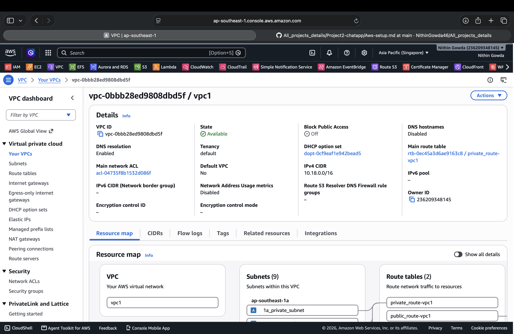
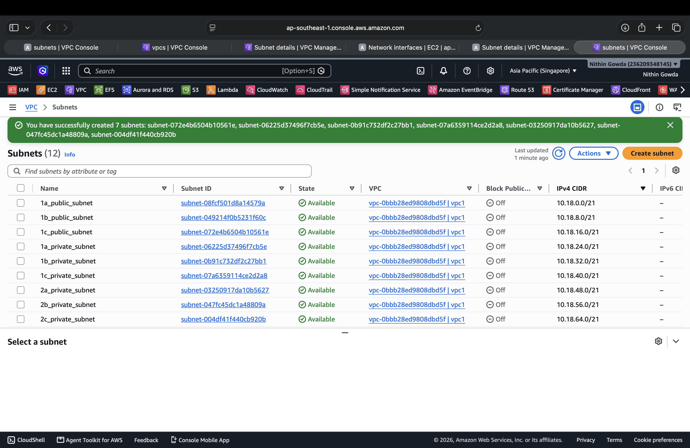
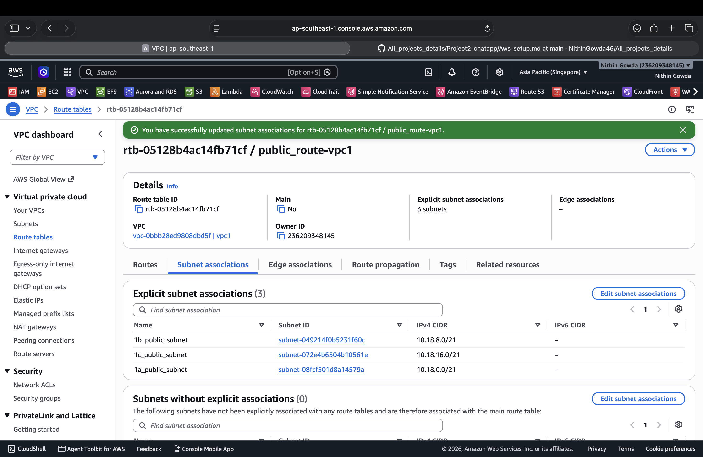
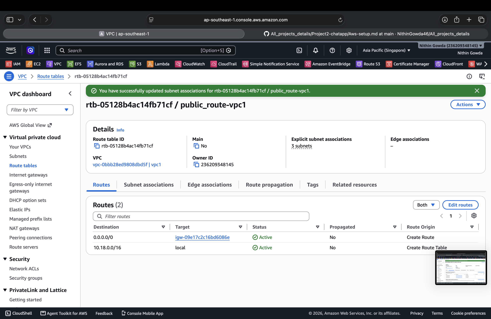
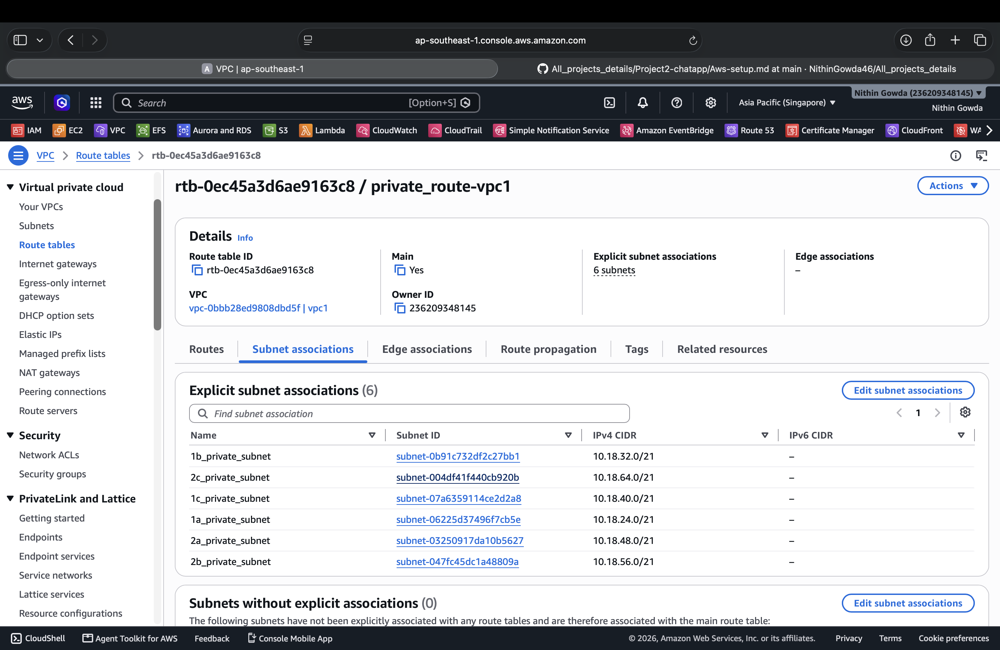
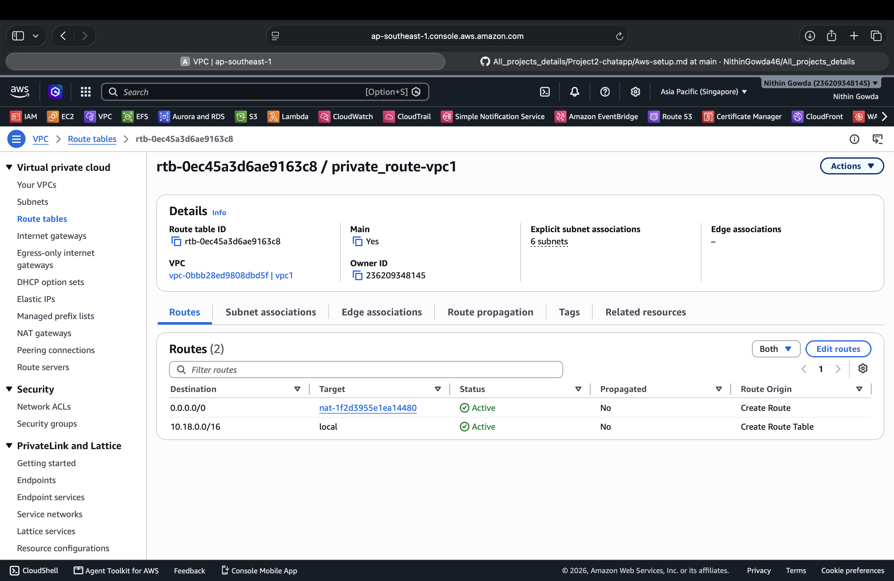
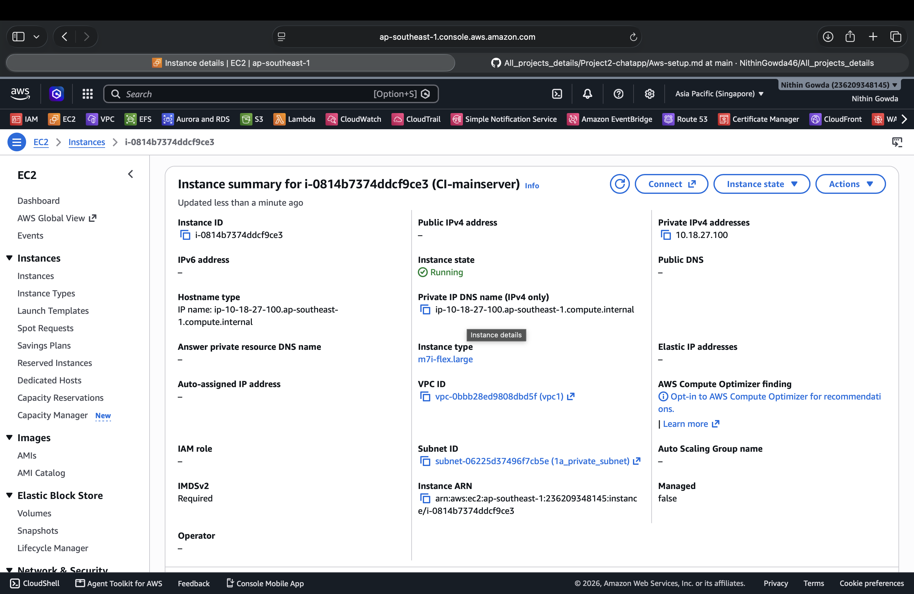
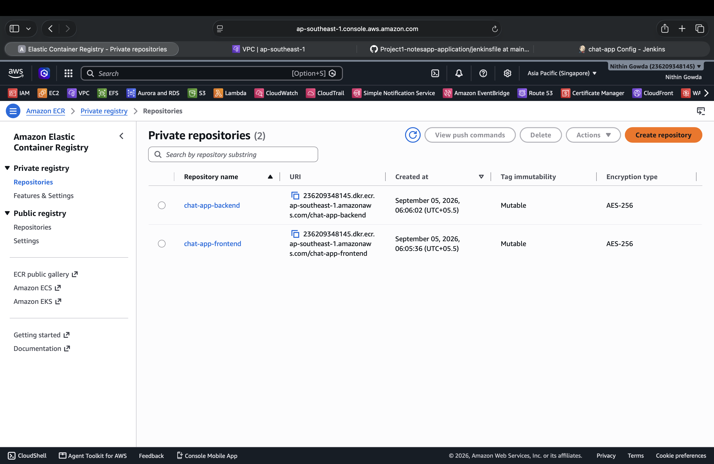
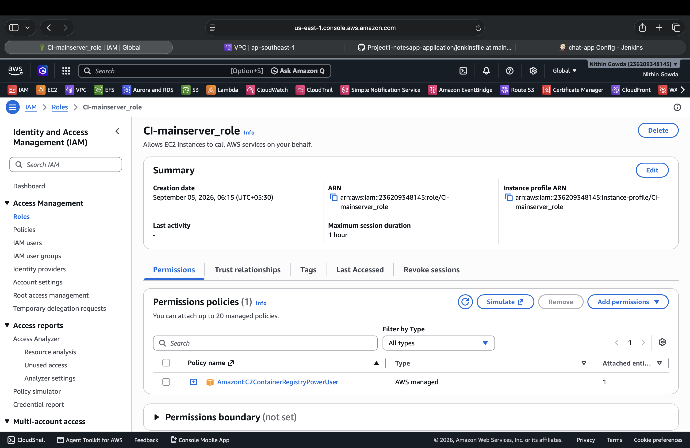

# DevOps Project

This project demonstrates the implementation of a complete DevOps environment on AWS, including CI/CD, containerization, Kubernetes, monitoring, security, and application deployment.

---

# 1. VPC Setup

## 1.1 VPC

The VPC provides an isolated network environment for all AWS resources.  
It contains separate public and private subnets for better security and organization.

### AWS Region

- **Region:** `ap-southeast-1` (Singapore)

<table>
<tr>
<th>VPC</th>
<th>Subnets</th>
</tr>
<tr>
<td>

</td>
<td>

</td>
</tr>
</table>

---

## 1.2 Public Route Table

The public route table provides Internet connectivity to resources deployed in public subnets.  
An Internet Gateway is attached to the VPC for Internet access.

### Internet Gateway

- Create an **Internet Gateway** and attach it to the VPC.

<table>
<tr>
<th>Subnet Association</th>
<th>Routes</th>
</tr>
<tr>
<td>

</td>
<td>

</td>
</tr>
</table>

---

## 1.3 Private Route Table

The private route table is used for resources that should not be directly accessible from the Internet.  
A NAT Gateway provides outbound Internet connectivity for resources in private subnets.

### NAT Gateway

- Create a **NAT Gateway** in a public subnet.

<table>
<tr>
<th>Subnet Association</th>
<th>Routes</th>
</tr>
<tr>
<td>

</td>
<td>

</td>
</tr>
</table>

---

## 1.4 AWS Client VPN

The AWS Client VPN provides secure access from the local machine to resources inside the VPC.  
It allows access to private resources using their private IP addresses.

[Refer to AWS Client VPN Setup Guide](https://github.com/NithinGowda46/installation_guide/blob/fc753c567fac7177054e2c977604a045ce3ff93d/8.AWS/vpn.md)

---

# 2. EC2 Instance Setup

## 2.1 CI Server

The CI server is used for Jenkins and other CI/CD tools.  
It is deployed in the private subnet for secure access.



### Configuration

- **Name:** `CI-mainserver`
- **Instance Type:** `m7i-flex.large`
- **vCPU:** 2
- **Memory:** 8 GB
- **Subnet:** `1a_private_subnet`
- **Public IPv4:** None
- **Private IPv4:** `10.18.27.100`
- **OS:** Amazon Linux 2023
- **Architecture:** x86_64
- **IMDSv2:** Required

---

## 2.2 CD Server

The CD server is used for Argo CD, Prometheus, and Grafana.  
It is deployed in the private subnet for secure access.


### Configuration

- **Name:** `CD-mainserver`
- **Instance Type:** `m7i-flex.large`
- **vCPU:** 2
- **Memory:** 8 GB
- **Subnet:** `1b_private_subnet`
- **Public IPv4:** None
- **Private IPv4:** `10.18.35.188`
- **OS:** Amazon Linux 2023
- **Architecture:** x86_64
- **IMDSv2:** Required

---

# 3. CI Server Setup

## 3.1 Login to CI Server

Connect to the CI server using SSH through the AWS Client VPN.

## 3.2 Install Required Tools

### Git

[Git Installation Guide](#)

### Jenkins

[Jenkins Installation Guide](#)

### AWS CLI

[AWS CLI Installation Guide](#)

### Docker

[Docker Installation Guide](#)

---

## 3.3 Configure Jenkins for Docker

Add the `jenkins` user to the Docker group so Jenkins can execute Docker commands without `sudo`.

```bash
sudo usermod -aG docker jenkins
sudo systemctl restart jenkins
```

Verify Docker access:

```bash
sudo -u jenkins docker ps
```

---

# 4. Amazon ECR

Amazon ECR is used to store and manage the Docker images built by Jenkins.  
Separate private repositories are created for the frontend and backend applications.

## 4.1 ECR Repositories



---

## 4.2 IAM Role for ECR

An IAM role is attached to the CI server to provide access to Amazon ECR.  
The `AmazonEC2ContainerRegistryPowerUser` policy allows Jenkins to push Docker images to ECR.



---

# 5. Docker Configuration

## 5.1 Dockerfiles

Create separate Dockerfiles for the frontend and backend applications.

### Frontend Dockerfile

```dockerfile
FROM node:18-alpine AS build

WORKDIR /app

COPY package*.json ./
RUN npm ci

COPY . .
RUN npm run build

FROM nginx:alpine

COPY --from=build /app/dist /usr/share/nginx/html

EXPOSE 80

CMD ["nginx", "-g", "daemon off;"]
```

### Backend Dockerfile

```dockerfile
FROM node:18-alpine

WORKDIR /app

COPY package*.json ./
RUN npm ci --omit=dev

COPY . .

EXPOSE 5001

CMD ["npm", "start"]
```

---

# 6. Jenkins CI Pipeline

The Jenkins pipeline clones the application, builds the frontend and backend Docker images, and pushes them to Amazon ECR.

```groovy
pipeline {
    agent any

    stages {

        stage('Clone Application') {
            steps {
                git branch: 'main',
                    url: 'https://github.com/NithinGowda46/Project2-chatapp-CI.git'
            }
        }

        stage('Build Backend Image') {
            steps {
                sh '''
                    docker build --no-cache \
                    -t chat-app-backend:${BUILD_NUMBER} \
                    ./backend
                '''
            }
        }

        stage('Build Frontend Image') {
            steps {
                sh '''
                    docker build --no-cache \
                    -t chat-app-frontend:${BUILD_NUMBER} \
                    ./frontend
                '''
            }
        }

        stage('ECR Login') {
            steps {
                sh '''
                    aws ecr get-login-password --region ap-southeast-1 | \
                    docker login --username AWS --password-stdin \
                    236209348145.dkr.ecr.ap-southeast-1.amazonaws.com
                '''
            }
        }

        stage('Tag Backend Image') {
            steps {
                sh '''
                    docker tag \
                    chat-app-backend:${BUILD_NUMBER} \
                    236209348145.dkr.ecr.ap-southeast-1.amazonaws.com/chat-app-backend:${BUILD_NUMBER}
                '''
            }
        }

        stage('Push Backend Image') {
            steps {
                sh '''
                    docker push \
                    236209348145.dkr.ecr.ap-southeast-1.amazonaws.com/chat-app-backend:${BUILD_NUMBER}
                '''
            }
        }

        stage('Tag Frontend Image') {
            steps {
                sh '''
                    docker tag \
                    chat-app-frontend:${BUILD_NUMBER} \
                    236209348145.dkr.ecr.ap-southeast-1.amazonaws.com/chat-app-frontend:${BUILD_NUMBER}
                '''
            }
        }

        stage('Push Frontend Image') {
            steps {
                sh '''
                    docker push \
                    236209348145.dkr.ecr.ap-southeast-1.amazonaws.com/chat-app-frontend:${BUILD_NUMBER}
                '''
            }
        }
    }
}
```

---

# 7. CI Build Result

The Jenkins pipeline successfully builds the frontend and backend Docker images and pushes them to their respective Amazon ECR repositories.


---