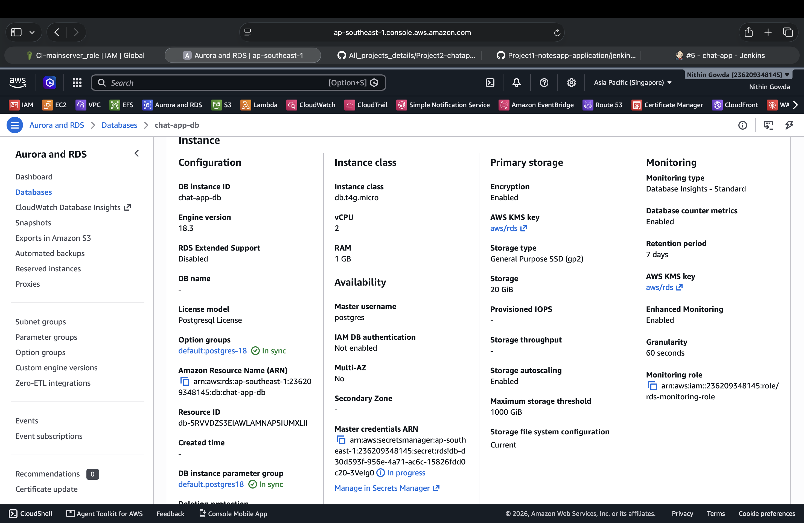
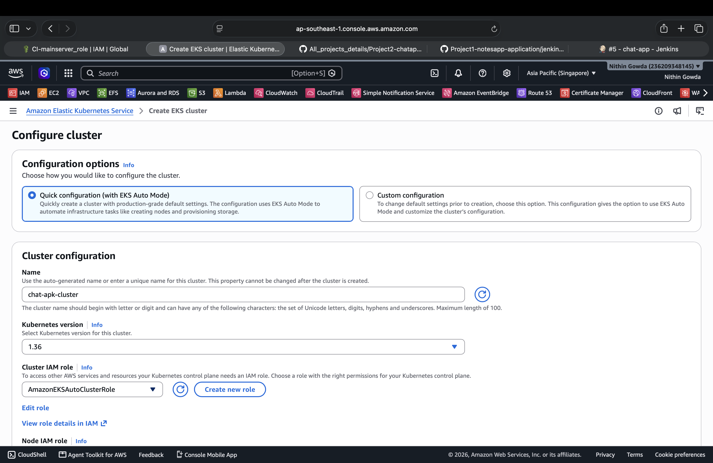
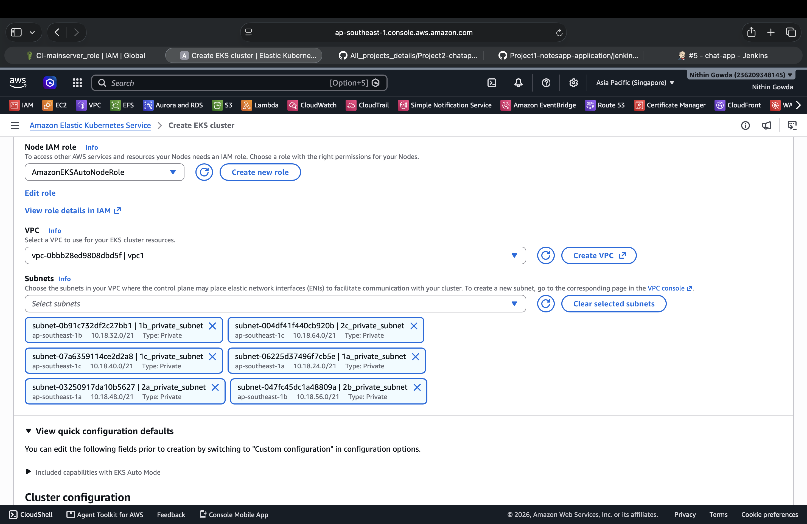
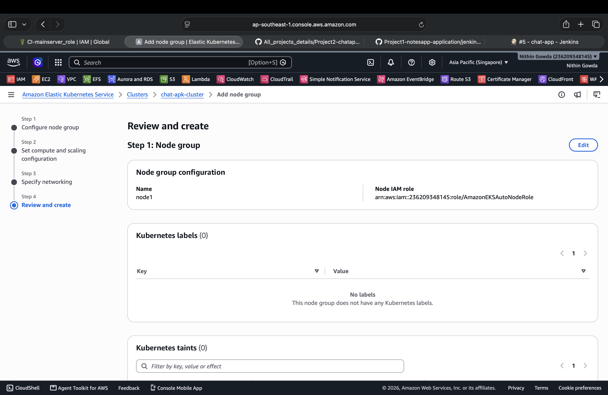
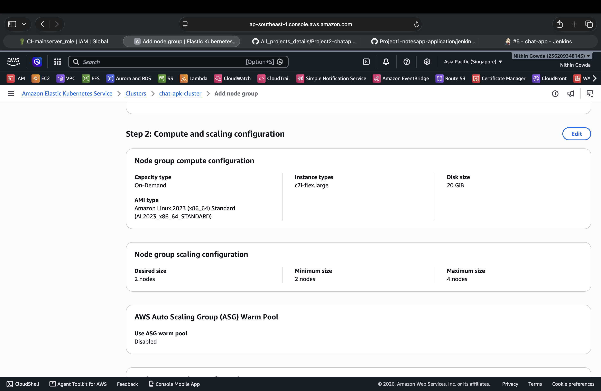
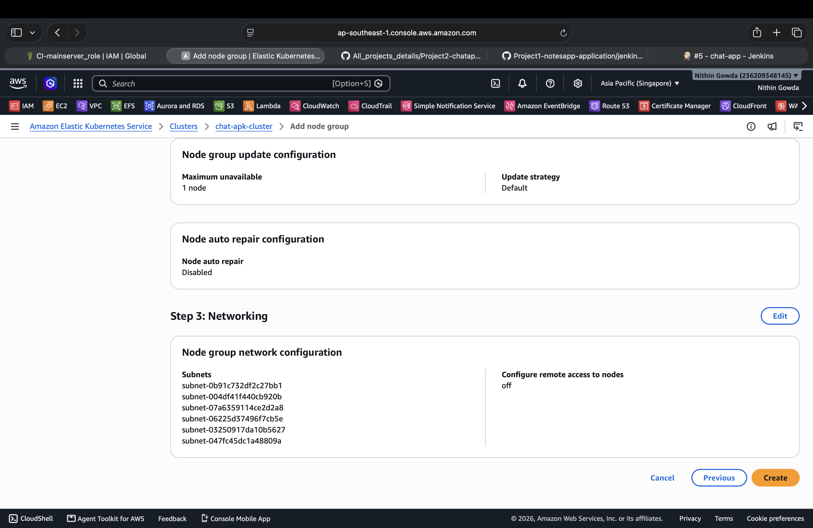

# 🔴 CD Setup

This section covers the resources required for Continuous Deployment and application deployment.

---

# 🔴 1. CD Server

The CD server is used for Argo CD, Prometheus, and Grafana.  
It is deployed in the private subnet for secure access.

### Configuration

- **Name:** `CD-mainserver`
- **Instance Type:** `m7i-flex.large`
- **vCPU:** 2
- **Memory:** 8 GB
- **Subnet:** `1b_private_subnet`
- **Public IPv4:** None
- **Private IPv4:** `10.18.35.188`
- **OS:** Amazon Linux 2023
- **Architecture:** x86_64
- **IMDSv2:** Required

---

# 🔴 2. Amazon RDS

Amazon RDS is used as the managed PostgreSQL database for the application.  
The database is deployed inside the VPC with private access.  
AWS Secrets Manager is used to manage the database credentials.

---

# 🔴 3. Amazon EKS

Amazon EKS is used to deploy and manage the Kubernetes cluster for the application.  
The EKS cluster is deployed inside the VPC using private subnets.

## 3.1 EKS Cluster Creation

Create the EKS cluster with the required Kubernetes version, IAM roles, VPC, and private subnets.

<table>
<tr>
<th>EKS Cluster</th>
<th>Cluster Configuration</th>
</tr>
<tr>
<td>

</td>
<td>

</td>
</tr>
</table>

---

## 3.2 EKS Node Group

Create a managed node group to provide worker nodes for running application workloads in the EKS cluster.

<table>
<tr>
<th>Node Group Configuration</th>
<th>Compute & Scaling</th>
<th>Networking</th>
</tr>
<tr>
<td>

</td>
<td>

</td>
<td>

</td>
</tr>
</table>

### Node Group Configuration

- **Node Group Name:** `node1`
- **Node IAM Role:** `AmazonEKSAutoNodeRole`
- **Capacity Type:** On-Demand
- **Instance Type:** `c7i-flex.large`
- **AMI:** Amazon Linux 2023
- **Disk Size:** 20 GiB
- **Desired Nodes:** 2
- **Minimum Nodes:** 2
- **Maximum Nodes:** 4
- **Auto Scaling Group Warm Pool:** Disabled
- **Node Auto Repair:** Disabled
- **Remote Access:** Off

---

## 3.3 Disable EKS Auto Mode

After the managed node group is created, disable **EKS Auto Mode** so that only the manually configured node group is used.

- Go to **EKS → Cluster → Compute → Manage EKS Auto Mode**.
- Turn off **Use EKS Auto Mode**.
- Click **Save changes**.
- The EC2 instances managed by EKS Auto Mode will be terminated.

---