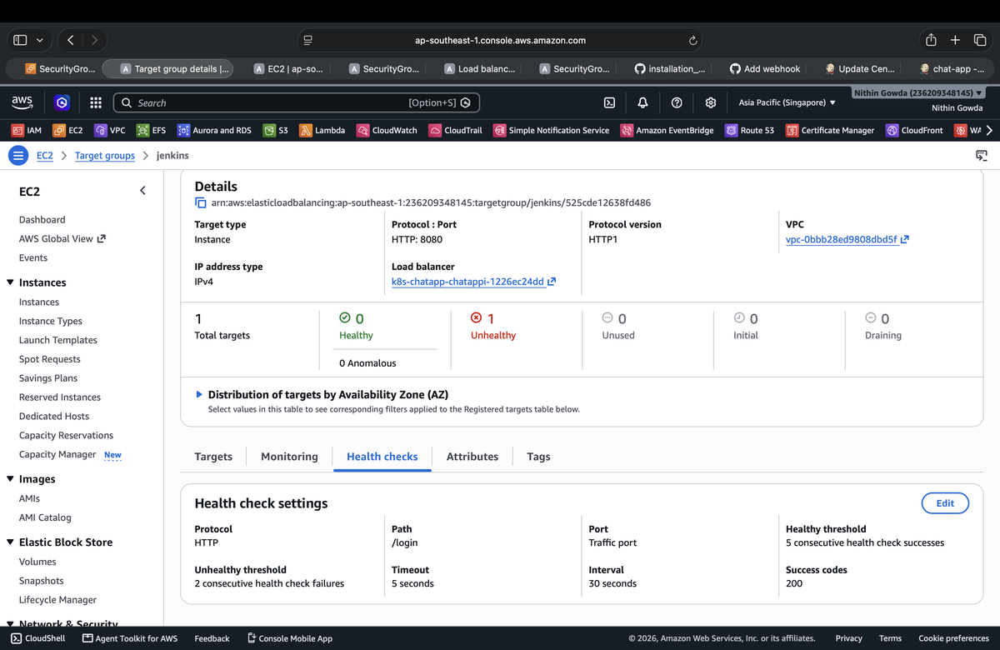

# Project 2 --- Chat Application Production Setup

## 🔴 1. Jenkins Setup

### 1.1 Jenkins--Git SSH Setup

Jenkins installation and Git SSH configuration:

[Jenkins & Git SSH Installation
Guide](https://github.com/NithinGowda46/installation_guide/blob/97ea4d33e343842d8593243b7d09a0b71746b52e/2.jenkins/jenkins-github.md)

### 1.2 Jenkins ALB Setup

Jenkins is running on the **CI Main Server** using its private IP. An
Application Load Balancer is used to provide access to Jenkins.

#### Jenkins Target Group

The Jenkins target group is configured with:

``` text
Target type: Instance
Protocol: HTTP
Port: 8080
IP address type: IPv4
```

The **CI Main Server** is registered as the target.

``{=html}

``` text
Jenkins Target Group
        │
        ▼
CI Main Server
Private IP
Port 8080
```

#### Jenkins ALB Listener

Port `80` is already used by the main application, so Jenkins uses a
separate ALB listener on port `8080`.

``` text
Protocol: HTTP
Port: 8080
Default action: Forward to target group
Target group: jenkins
```

``{=html}

ALB routing:

``` text
ALB
├── HTTP : 80
│      └── Main Application
│
└── HTTP : 8080
       └── Jenkins Target Group
              └── CI Main Server : 8080
```

Jenkins is accessed through:

``` text
http://<ALB-DNS>:8080
```

#### ALB Security Group

The ALB Security Group allows inbound traffic for the main application
and Jenkins.

``` text
Inbound Rules

HTTP
Port: 80
Source: 0.0.0.0/0
Description: Main Application

Custom TCP
Port: 8080
Source: 0.0.0.0/0
Description: Jenkins
```

``{=html}

#### CI Main Server Security Group

The CI Main Server allows Jenkins traffic from the ALB Security Group.

``` text
Type: Custom TCP
Port: 8080
Source: <ALB-Security-Group-ID>
Description: Jenkins-alb
```

``{=html}

The CI server's Jenkins port is not directly exposed to the internet.

``` text
Internet
    │
    ▼
Application Load Balancer
    │
    │ HTTP : 8080
    ▼
CI Main Server
Private IP
    │
    ▼
Jenkins : 8080
```

#### Jenkins Target Group Health Check

The Jenkins target group uses the Jenkins login endpoint for health
checks.

``` text
Health Check Protocol: HTTP
Health Check Port: Traffic port
Health Check Path: /login
Healthy Threshold: 5
Unhealthy Threshold: 2
Timeout: 5 seconds
Interval: 30 seconds
Success Codes: 200
```

``{=html}

The `/login` endpoint is used because the Jenkins `/` endpoint can
return `403 Forbidden` when Jenkins security is enabled.

Health check flow:

``` text
ALB
  │
  │ HTTP : 8080
  ▼
/login
  │
  ▼
HTTP 200
  │
  ▼
Target: Healthy
```

After the health check succeeds, the CI Main Server appears as healthy
in the Jenkins target group.

``{=html}

``` text
Target Group
     │
     ▼
CI-mainserver : 8080
     │
     ▼
Healthy
```

#### Jenkins Access

Jenkins is accessed through the ALB:

``` text
http://<ALB-DNS>:8080
```

Final traffic flow:

``` text
User
 │
 ▼
ALB : 8080
 │
 ▼
Jenkins Target Group
 │
 ▼
CI Main Server Private IP : 8080
 │
 ▼
Jenkins
```

### 1.3 Jenkins--Git Webhook Setup

Jenkins and GitHub webhook configuration:

[Jenkins Webhooks Installation
Guide](https://github.com/NithinGowda46/installation_guide/blob/97ea4d33e343842d8593243b7d09a0b71746b52e/2.jenkins/jenkins-webhooks.md)
