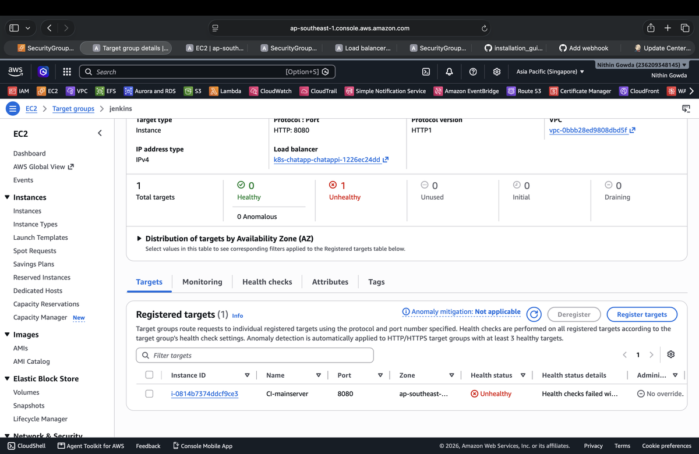
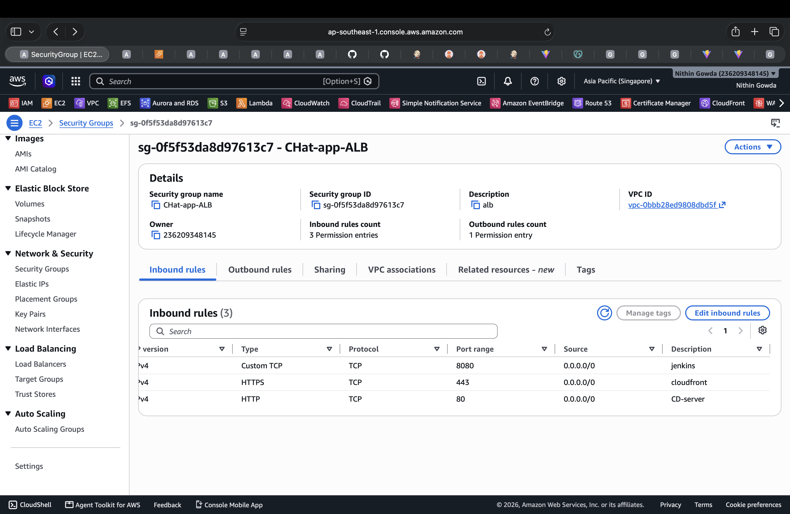
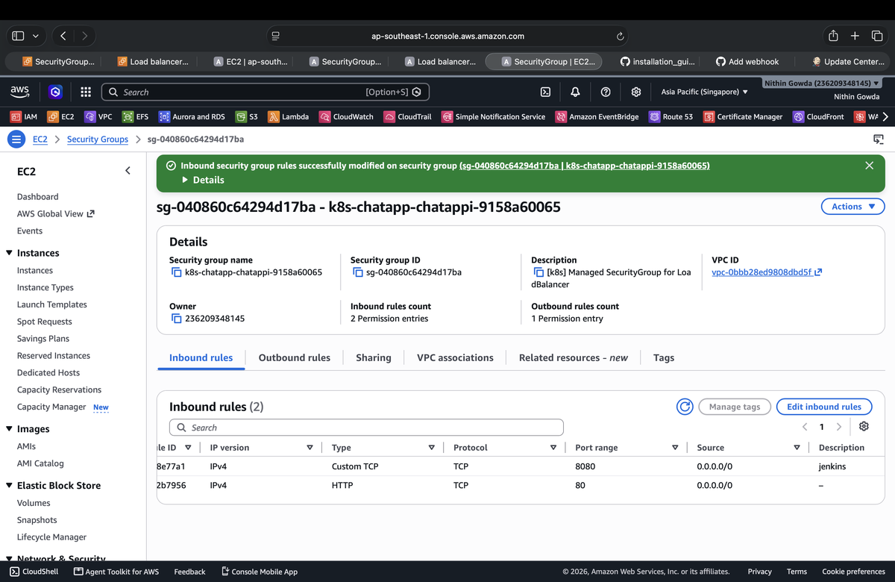
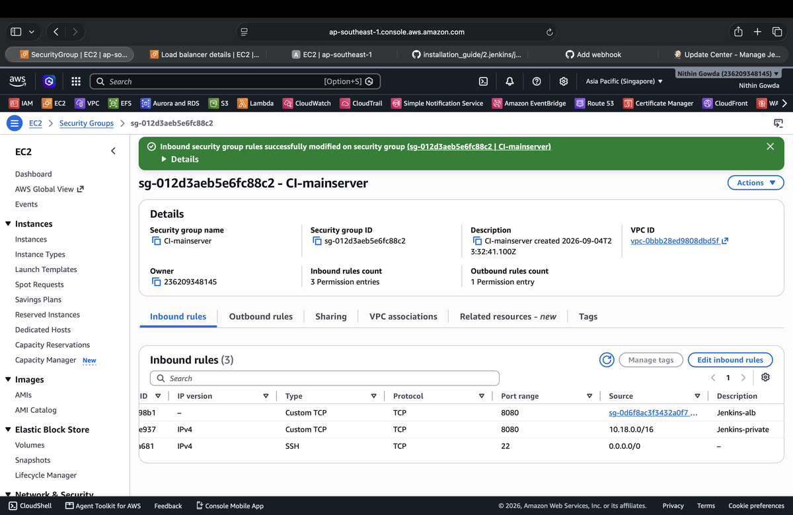
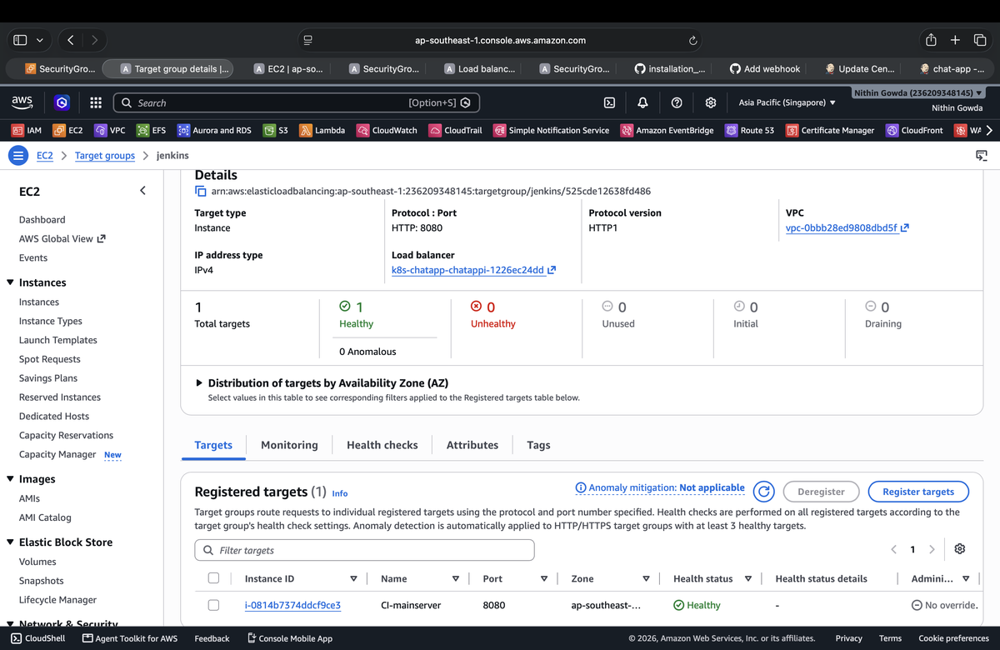

# Project 2 --- Chat Application Production Setup

## 🔴 1. Jenkins Setup

### 1.1 Jenkins--Git SSH Setup

Jenkins installation and Git SSH configuration:

[Jenkins & Git SSH Installation Guide](https://github.com/NithinGowda46/installation_guide/blob/97ea4d33e343842d8593243b7d09a0b71746b52e/2.jenkins/jenkins-github.md)

---

### 1.2 Jenkins ALB Setup

Jenkins runs on the **CI Main Server** using its private IP and is accessed through an Application Load Balancer.

#### Jenkins Target Group

```text
Target type: Instance
Protocol: HTTP
Port: 8080
```

The CI Main Server is registered as the target.



#### Jenkins ALB Listener

Port `80` is used by the main application, so Jenkins uses port `8080`.

```text
Protocol: HTTP
Port: 8080
Action: Forward to target group
Target group: jenkins
```



```text
ALB
├── :80   → Main Application
└── :8080 → Jenkins → CI Main Server :8080
```

#### Security Groups

**ALB Security Group**

```text
HTTP        : 80    → 0.0.0.0/0
Custom TCP  : 8080  → 0.0.0.0/0
```



**CI Main Server Security Group**

```text
Custom TCP : 8080 → ALB Security Group
```



#### Jenkins Health Check

```text
Protocol: HTTP
Port: Traffic port
Path: /login
Healthy threshold: 5
Unhealthy threshold: 2
Timeout: 5 seconds
Interval: 30 seconds
Success codes: 200
```

`/login` is used because Jenkins `/` can return `403 Forbidden` when authentication is enabled.


After the health check succeeds, the CI Main Server becomes healthy.



#### Jenkins Access

```text
http://<ALB-DNS>:8080
```

```text
User
 ↓
ALB :8080
 ↓
Jenkins Target Group
 ↓
CI Main Server :8080
 ↓
Jenkins
```
---

### 1.3 Jenkins--Git Webhook Setup

Jenkins and GitHub webhook configuration:

[Jenkins Webhooks Installation Guide](https://github.com/NithinGowda46/installation_guide/blob/97ea4d33e343842d8593243b7d09a0b71746b52e/2.jenkins/jenkins-webhooks.md)

---

### 1.4 Jenkins CI/CD Pipeline

The following Jenkins pipeline builds the frontend and backend Docker images, pushes them to Amazon ECR, and updates the image tags in the CD repository.

```groovy
pipeline {
    agent any

    stages {

        stage('Git Config') {
            steps {
                sh '''
                    git config --global user.name "Nithin Gowda"
                    git config --global user.email "nithingowdai46@gmail.com"
                '''
            }
        }

        stage('Clone Application') {
            steps {
                git branch: 'main',
                    url: 'https://github.com/NithinGowda46/Project2-chatapp-CI.git'
            }
        }

        stage('Build Backend Image') {
            steps {
                sh '''
                    docker build --no-cache \
                    -t chat-app-backend:${BUILD_NUMBER} \
                    ./backend
                '''
            }
        }

        stage('Build Frontend Image') {
            steps {
                sh '''
                    docker build --no-cache \
                    -t chat-app-frontend:${BUILD_NUMBER} \
                    ./frontend
                '''
            }
        }

        stage('ECR Login') {
            steps {
                sh '''
                    aws ecr get-login-password --region ap-southeast-1 | \
                    docker login --username AWS --password-stdin \
                    236209348145.dkr.ecr.ap-southeast-1.amazonaws.com
                '''
            }
        }

        stage('Tag Backend Image') {
            steps {
                sh '''
                    docker tag \
                    chat-app-backend:${BUILD_NUMBER} \
                    236209348145.dkr.ecr.ap-southeast-1.amazonaws.com/chat-app-backend:${BUILD_NUMBER}
                '''
            }
        }

        stage('Push Backend Image') {
            steps {
                sh '''
                    docker push \
                    236209348145.dkr.ecr.ap-southeast-1.amazonaws.com/chat-app-backend:${BUILD_NUMBER}
                '''
            }
        }

        stage('Tag Frontend Image') {
            steps {
                sh '''
                    docker tag \
                    chat-app-frontend:${BUILD_NUMBER} \
                    236209348145.dkr.ecr.ap-southeast-1.amazonaws.com/chat-app-frontend:${BUILD_NUMBER}
                '''
            }
        }

        stage('Push Frontend Image') {
            steps {
                sh '''
                    docker push \
                    236209348145.dkr.ecr.ap-southeast-1.amazonaws.com/chat-app-frontend:${BUILD_NUMBER}
                '''
            }
        }

        stage('Clone CD Repository') {
            steps {
                dir('cd-repo') {
                    git branch: 'main',
                        credentialsId: 'github-ssh',
                        url: 'git@github.com:NithinGowda46/Project2-chatapp-CD.git'
                }
            }
        }

        stage('Update Backend Image') {
            steps {
                dir('cd-repo') {
                    sh '''
                        sed -i "s|image: 236209348145.dkr.ecr.ap-southeast-1.amazonaws.com/chat-app-backend:.*|image: 236209348145.dkr.ecr.ap-southeast-1.amazonaws.com/chat-app-backend:${BUILD_NUMBER}|" k8s/backend_deployment.yaml
                    '''
                }
            }
        }

        stage('Update Frontend Image') {
            steps {
                dir('cd-repo') {
                    sh '''
                        sed -i "s|image: 236209348145.dkr.ecr.ap-southeast-1.amazonaws.com/chat-app-frontend:.*|image: 236209348145.dkr.ecr.ap-southeast-1.amazonaws.com/chat-app-frontend:${BUILD_NUMBER}|" k8s/frontend_deployment.yaml
                    '''
                }
            }
        }

        stage('Git Commit') {
            steps {
                dir('cd-repo') {
                    sh '''
                        git add k8s/backend_deployment.yaml k8s/frontend_deployment.yaml && \
                        git commit -m "Update backend and frontend images to build ${BUILD_NUMBER}" || \
                        echo "No changes to commit"
                    '''
                }
            }
        }

        stage('Git Push') {
            steps {
                dir('cd-repo') {
                    sh '''
                        git push origin main
                    '''
                }
            }
        }
    }
}

