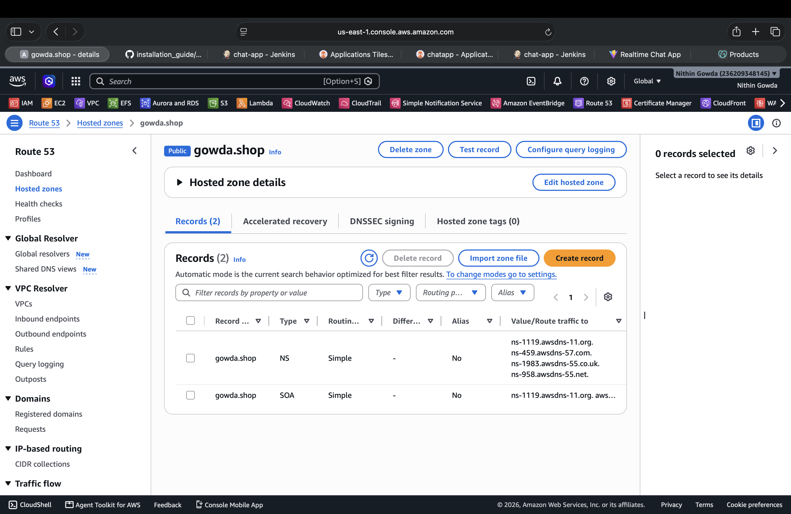
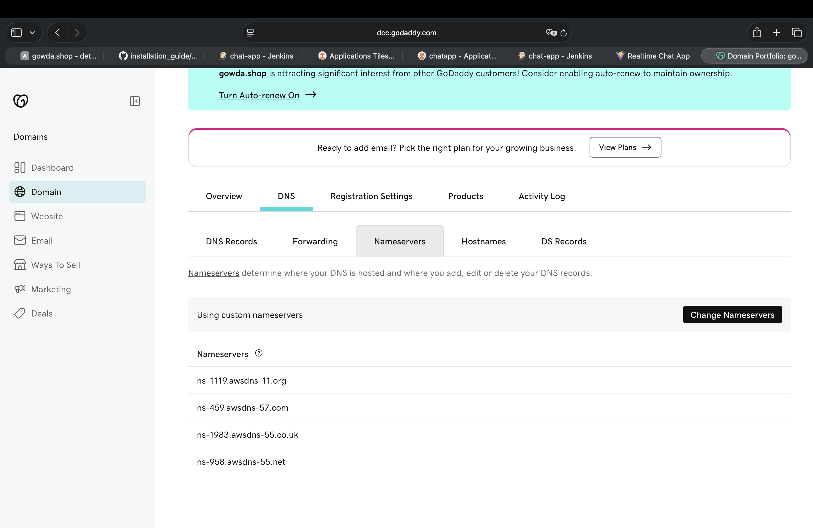
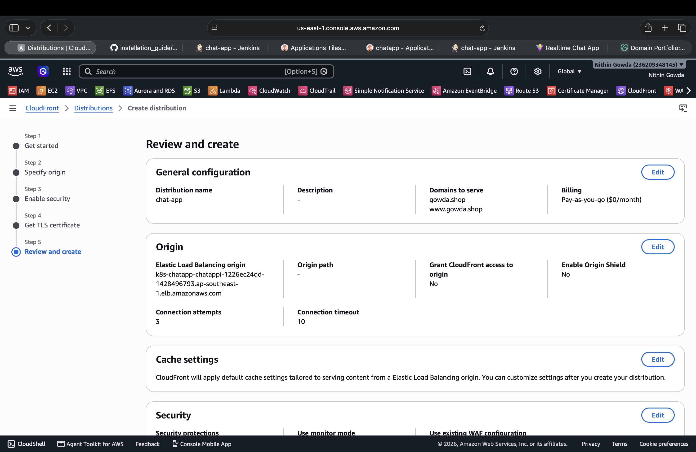
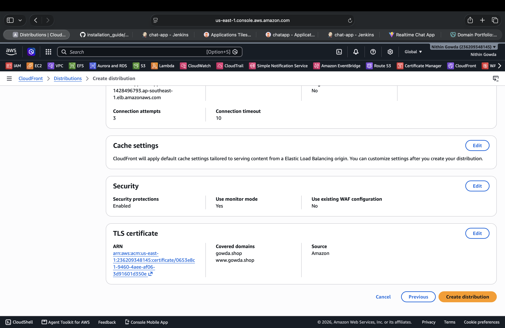
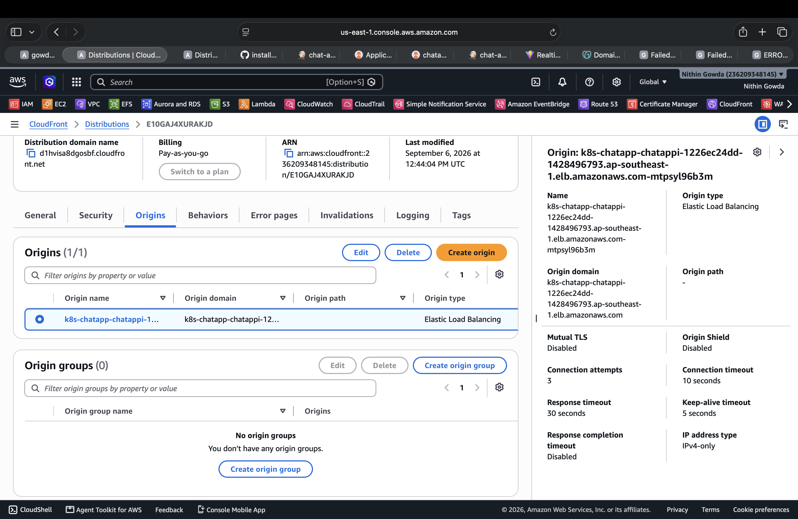
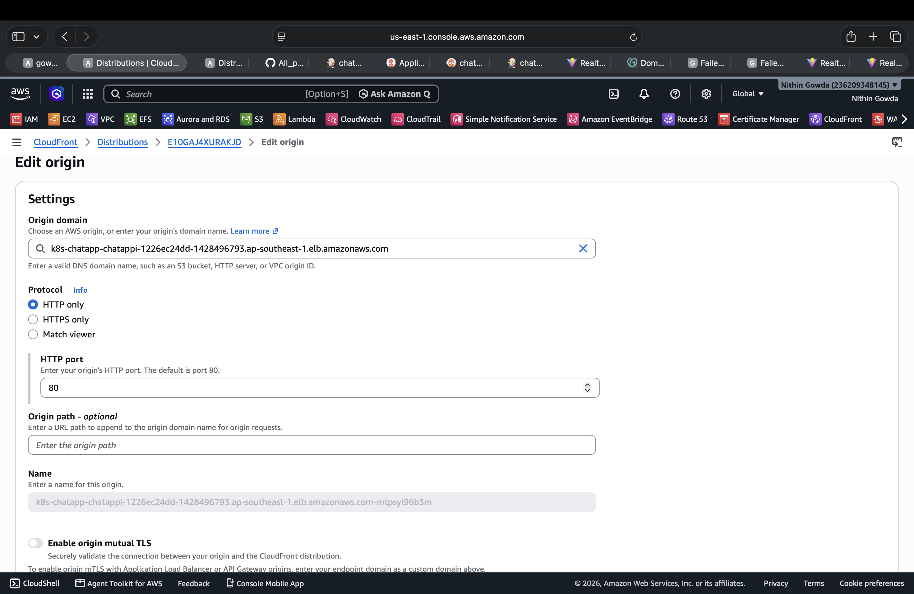
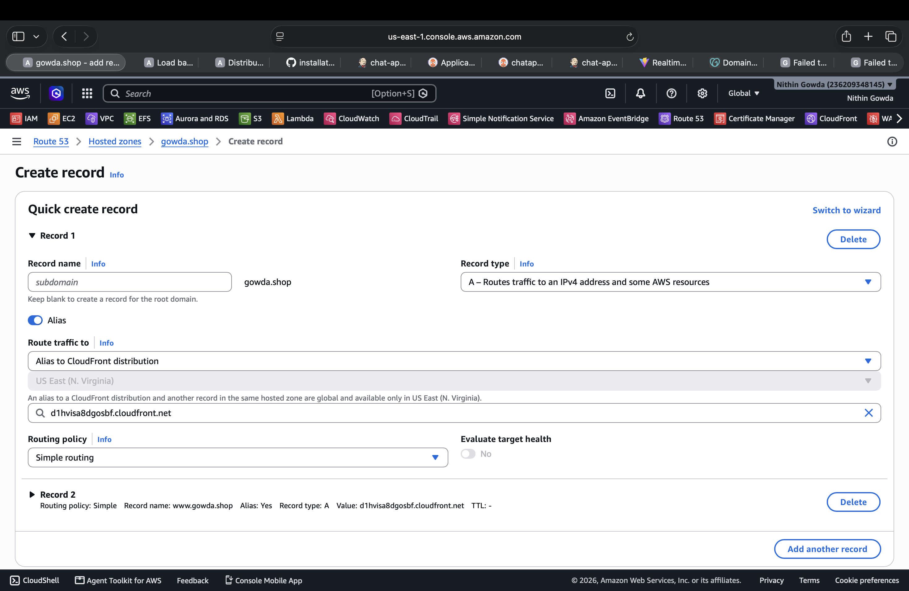
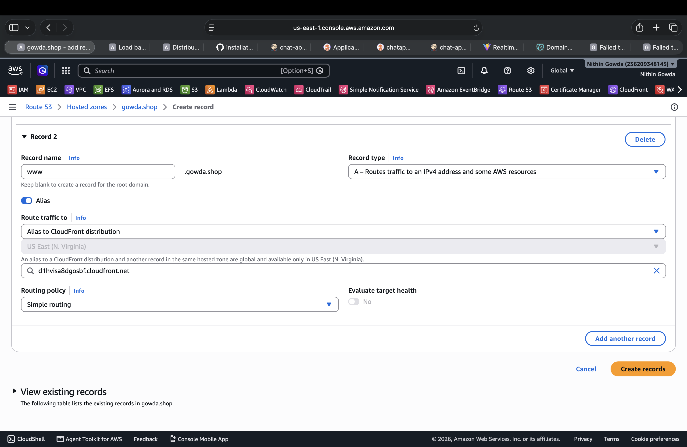
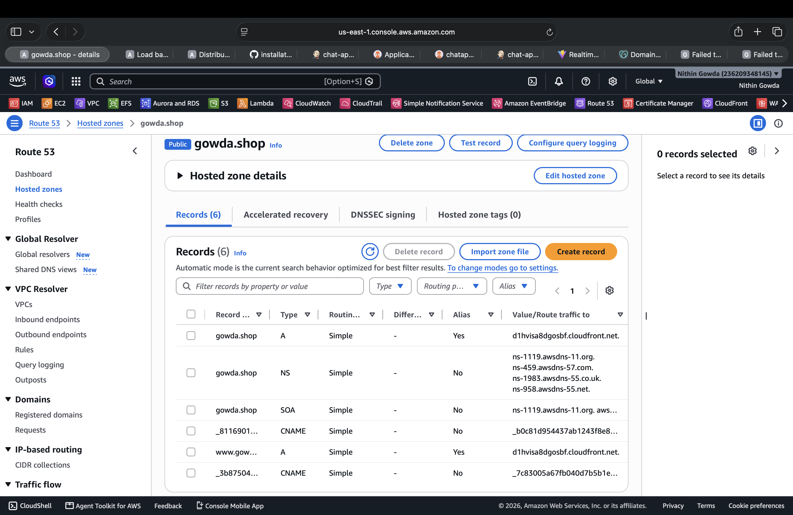

# Project 2 --- Chat Application Production Setup

## 🔴 1. Domain & Route 53 Setup

### 1.1 Create Route 53 Hosted Zone

Create a **Public Hosted Zone** for the production domain:

```text
Domain name: gowda.shop
Type: Public hosted zone
```

Route 53 automatically creates the following records:

```text
NS
SOA
```

The NS records are required to delegate DNS management from the domain registrar to Route 53.



---

### 1.2 Update Domain Nameservers

The domain is registered with **GoDaddy**, while DNS is managed by **Route 53**.

In GoDaddy:

```text
Domains
   ↓
gowda.shop
   ↓
DNS
   ↓
Nameservers
   ↓
Change Nameservers
```

Select **Custom nameservers** and replace the GoDaddy nameservers with the four Route 53 nameservers from the hosted zone.

Example:

```text
ns-1119.awsdns-11.org
ns-459.awsdns-57.com
ns-1983.awsdns-55.co.uk
ns-958.awsdns-55.net
```



After the nameserver delegation is complete:

```text
GoDaddy
   │
   │ DNS delegation
   ▼
Route 53
```

Route 53 is now the authoritative DNS service for `gowda.shop`.

---

## 🔴 2. ACM & CloudFront Setup

### 2.1 Request ACM Certificate for CloudFront

CloudFront requires the ACM certificate used for viewer HTTPS to be created in:

```text
AWS Region: us-east-1 (N. Virginia)
```

Request a **Public certificate** for:

```text
gowda.shop
www.gowda.shop
```

Use:

```text
Validation method: DNS validation
Export: Disabled
```

> **Important:** Only the `us-east-1` ACM certificate is required for the current architecture because CloudFront connects to the EKS ALB over **HTTP**. A separate ACM certificate in `ap-southeast-1` is not required.

Complete DNS validation by creating the ACM CNAME validation records in the Route 53 hosted zone.

The certificate must show:

```text
Status: Issued
```

---

### 2.2 Configure CloudFront Distribution

Create a CloudFront distribution for the chat application.

```text
Distribution name:
chat-app
```

Add the alternate domain names:

```text
gowda.shop
www.gowda.shop
```

Use the EKS Application Load Balancer as the origin:

```text
Origin type:
Elastic Load Balancing

Origin domain:
k8s-chatapp-chatappi-1226ec24dd-1428496793.ap-southeast-1.elb.amazonaws.com
```

The origin path is left empty.

```text
Origin path:
-
```



---

### 2.3 CloudFront Viewer TLS Certificate

Select the ACM certificate created in **us-east-1**.

The certificate must cover:

```text
gowda.shop
www.gowda.shop
```

CloudFront provides HTTPS access to users using this certificate.



Traffic flow:

```text
User
  │
  │ HTTPS
  ▼
CloudFront
  │
  ▼
EKS ALB
```

---

### 2.4 CloudFront Origin Protocol

The EKS ALB currently has only an **HTTP :80 listener**.

Therefore, CloudFront must connect to the origin using:

```text
Protocol: HTTP only
HTTP port: 80
```

Do **not** configure CloudFront as `HTTPS only` while the ALB has no HTTPS :443 listener.

Correct configuration:

```text
Browser
   │
   │ HTTPS
   ▼
CloudFront
   │
   │ HTTP :80
   ▼
EKS ALB
   │
   ▼
EKS
```



After configuration, verify the origin settings show HTTP communication with port `80`.



> If CloudFront is configured for HTTPS to the origin while the ALB only listens on port 80, CloudFront can return **504 Gateway Timeout** because it cannot successfully connect to the origin on port 443.

---

### 2.5 CloudFront Security

During distribution creation, CloudFront security protections can remain enabled.

For the initial deployment:

```text
Security protections: Enabled
Monitor mode: Yes
Existing WAF: No
```

WAF can be attached/configured separately as part of the application security setup.

---

## 🔴 3. Route 53 Records for CloudFront

After the CloudFront distribution is created, create Route 53 alias records that point the domain to the CloudFront distribution.

### 3.1 Root Domain

Create:

```text
Record name: gowda.shop
Record type: A
Alias: Yes
Route traffic to: CloudFront distribution
Routing policy: Simple
Evaluate target health: No
```

Select the CloudFront distribution:

```text
d1hvisa8dgosbf.cloudfront.net
```



---

### 3.2 WWW Domain

Create:

```text
Record name: www
Record type: A
Alias: Yes
Route traffic to: CloudFront distribution
Routing policy: Simple
Evaluate target health: No
```

Use the same CloudFront distribution:

```text
d1hvisa8dgosbf.cloudfront.net
```



---

## 🔴 4. Final Route 53 Configuration

The final Route 53 hosted zone contains:

```text
gowda.shop      A      Alias → CloudFront
www.gowda.shop  A      Alias → CloudFront
```

It also contains the automatically created NS/SOA records and ACM DNS validation CNAME records.



Final DNS flow:

```text
gowda.shop
     │
     └──→ CloudFront
             │
             ▼
           EKS ALB
             │
             ▼
            EKS
```

```text
www.gowda.shop
     │
     └──→ CloudFront
             │
             ▼
           EKS ALB
             │
             ▼
            EKS
```

---

## 🔴 5. Final Production Domain Architecture

```text
                         Internet User
                              │
                              │ HTTPS
                              ▼
                    ┌───────────────────┐
                    │     CloudFront    │
                    │                   │
                    │ gowda.shop        │
                    │ www.gowda.shop    │
                    └─────────┬─────────┘
                              │
                              │ HTTP :80
                              ▼
                    ┌───────────────────┐
                    │    EKS ALB        │
                    │  Internet-facing  │
                    └─────────┬─────────┘
                              │
                              ▼
                    ┌───────────────────┐
                    │   EKS Cluster     │
                    │                   │
                    │ Frontend :80      │
                    │ Backend :5001     │
                    └───────────────────┘
```

### Final Configuration Summary

| Component | Configuration |
|---|---|
| Domain registrar | GoDaddy |
| DNS provider | Route 53 |
| Domain | `gowda.shop` |
| WWW domain | `www.gowda.shop` |
| CloudFront region | Global |
| CloudFront ACM certificate | `us-east-1` |
| CloudFront viewer protocol | HTTPS |
| CloudFront origin | EKS ALB |
| CloudFront → ALB protocol | HTTP |
| ALB listener | HTTP :80 |
| EKS | Application workloads |

### Final Certificate Configuration

```text
Required:
✓ ACM certificate in us-east-1

Not required for the current architecture:
✗ Separate ACM certificate in ap-southeast-1
```

The regional ACM certificate would only be required if HTTPS were configured between CloudFront and the ALB.
