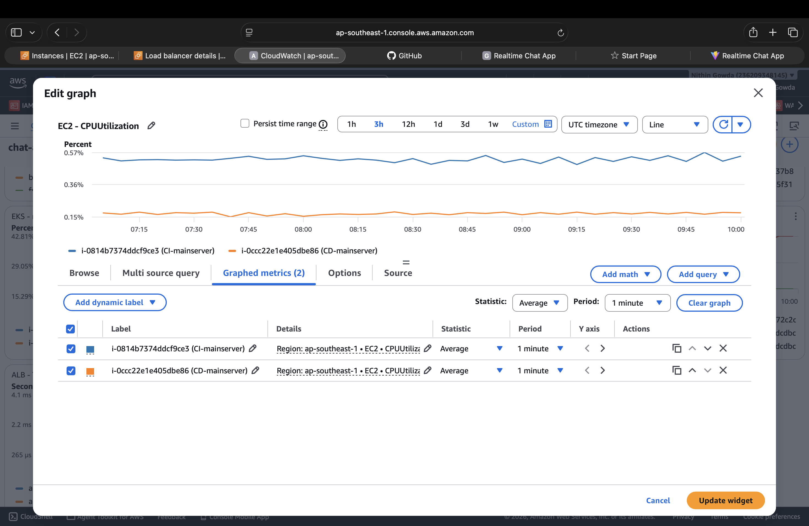
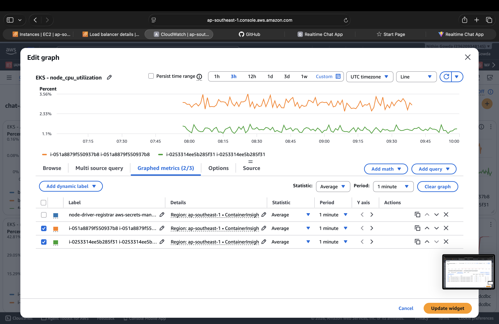
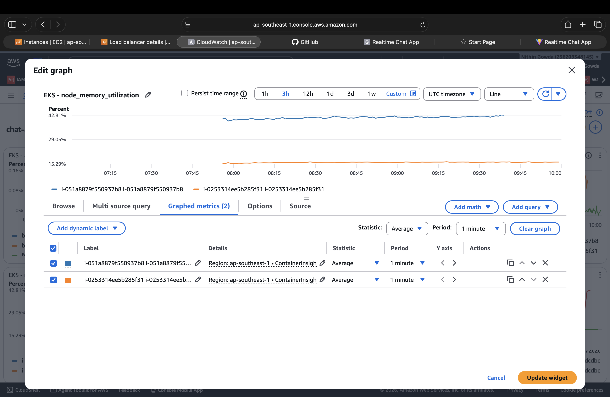
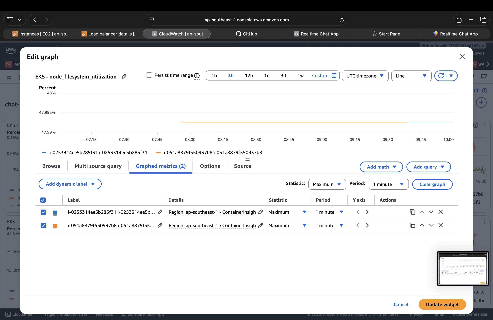
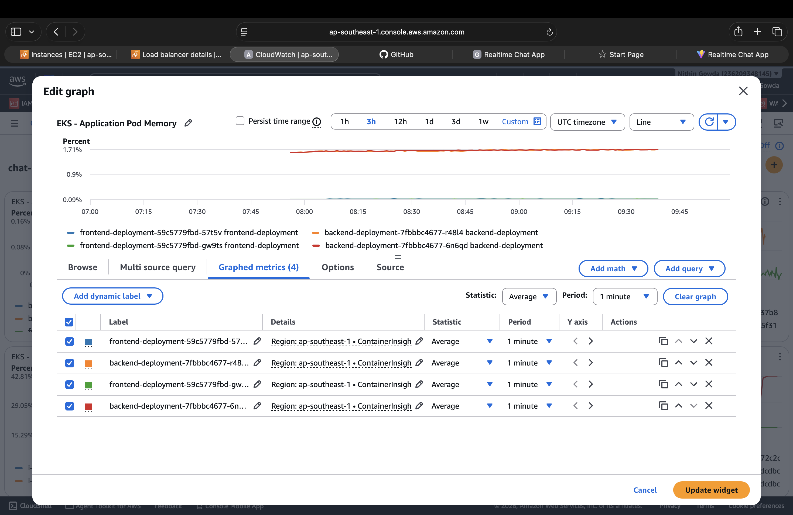
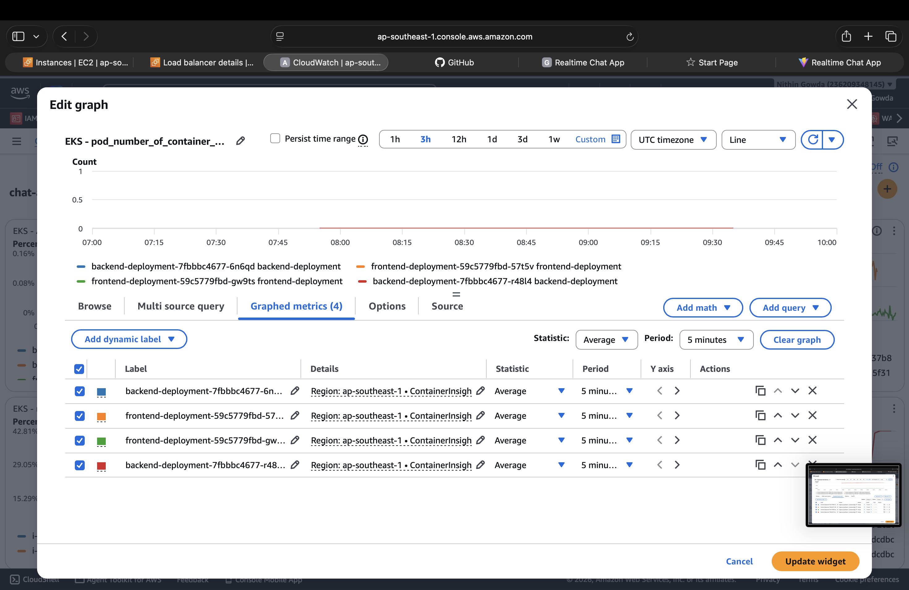
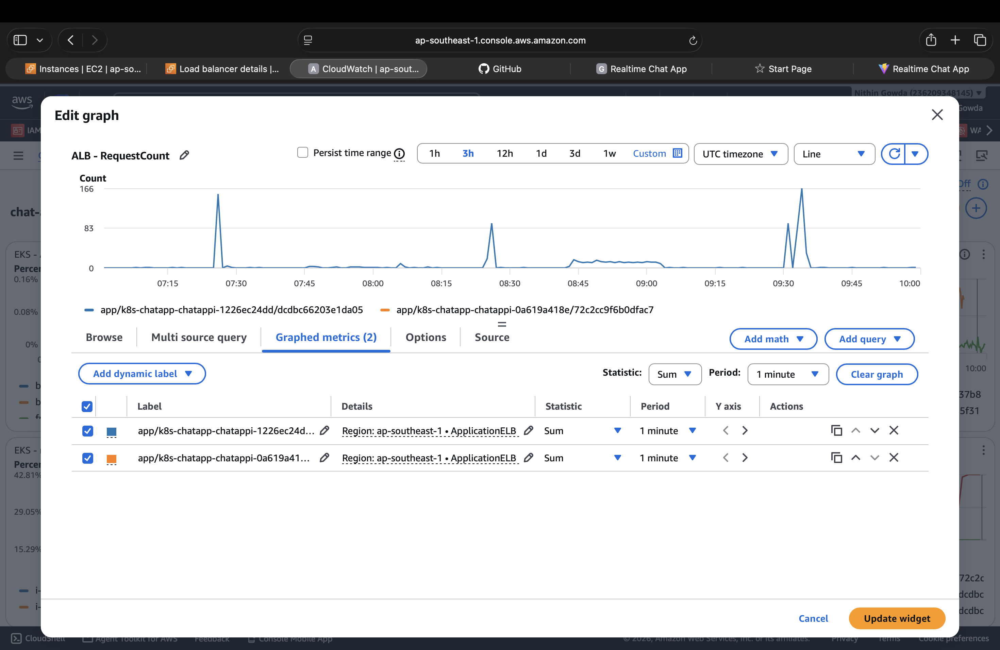
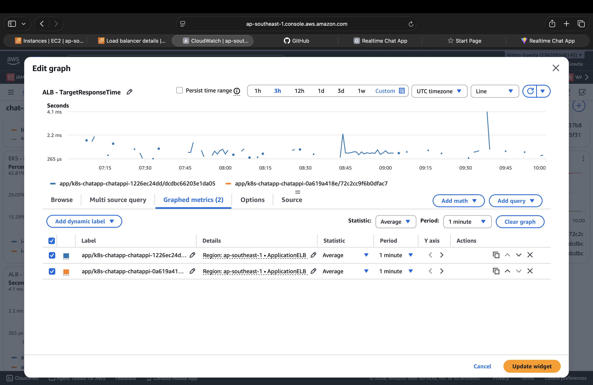
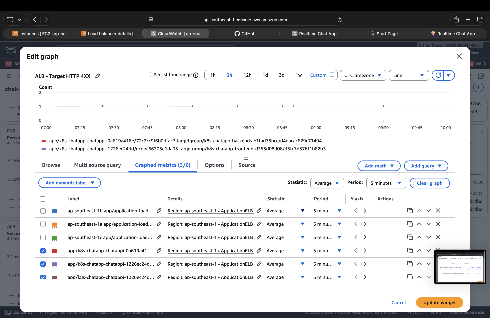
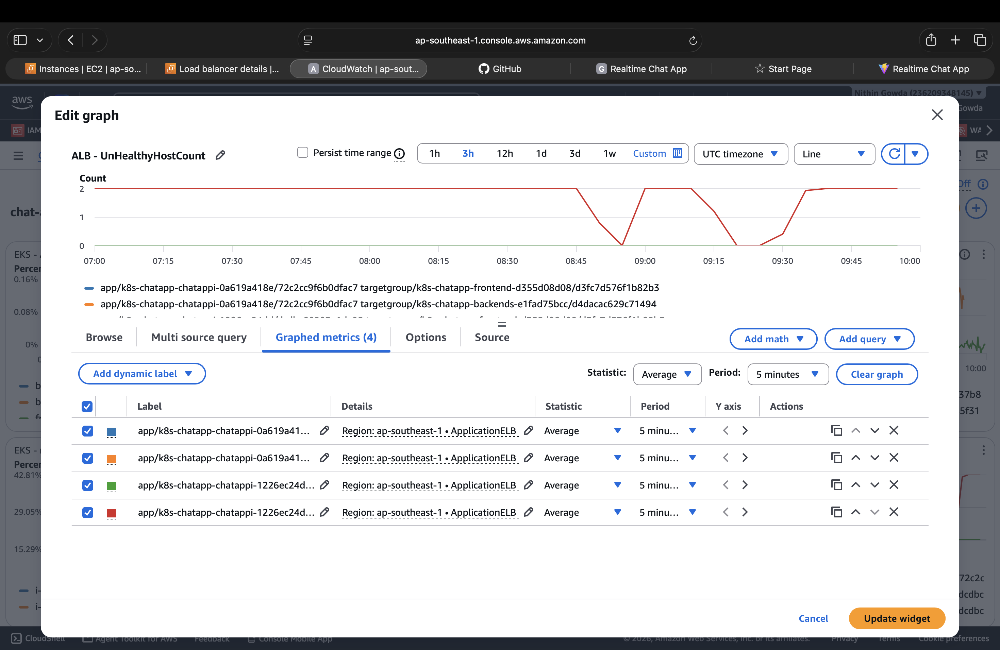

# 🔴 Monitoring Setup

This section covers monitoring for the AWS and EKS resources used by the Chat Application.

---

# 🔴 Monitoring Tool 1 — Amazon CloudWatch

Amazon CloudWatch is used to monitor application, Kubernetes, ALB, and EC2 metrics.

A CloudWatch dashboard is created to provide a single view of the important system metrics.

---

## 1.1 CloudWatch Dashboard

The dashboard contains the following monitoring metrics:

- EC2 CPU utilization
- EKS node CPU utilization
- EKS node memory utilization
- EKS node filesystem utilization
- EKS application pod memory
- Container restart count
- ALB request count
- ALB target response time
- ALB target HTTP 4XX count
- ALB unhealthy host count

---

## 1.2 EC2 Monitoring

### EC2 CPU Utilization

Monitors CPU utilization of the CI and CD EC2 servers.



---

## 1.3 EKS Node Monitoring

### Node CPU Utilization

Monitors CPU utilization of the EKS worker nodes.



### Node Memory Utilization

Monitors memory utilization of the EKS worker nodes.



### Node Filesystem Utilization

Monitors filesystem utilization of the EKS worker nodes.



---

## 1.4 Application Pod Monitoring

### Application Pod Memory

Monitors memory utilization of the frontend and backend application pods.



### Container Restart Count

Tracks container restarts to identify crashed or unstable application pods.



---

## 1.5 Application Load Balancer Monitoring

### Request Count

Monitors the number of requests received by the application target groups.



### Target Response Time

Monitors the response time of the application targets behind the ALB.



### Target HTTP 4XX

Monitors HTTP 4XX responses returned by the application targets.



### UnHealthy Host Count

Monitors the number of unhealthy targets registered with the ALB.



---

## 1.6 Purpose of Monitoring

The CloudWatch dashboard provides a quick view of the health and performance of the application infrastructure.

It helps identify:

- High CPU or memory utilization
- Node filesystem usage
- Container restart problems
- Increased application traffic
- Slow application response times
- HTTP 4XX errors
- Unhealthy ALB targets

---

## 1.7 CloudWatch Alarms

CloudWatch alarms and SNS notifications can be configured after the monitoring dashboard is completed.

They can be used to automatically notify the team when important metric thresholds are exceeded.

---

# 🔴 Monitoring Tool 2 — Prometheus & Grafana

Prometheus and Grafana are used for detailed Kubernetes and application monitoring.

- **Prometheus** collects and stores metrics.
- **Grafana** visualizes the metrics through dashboards.
- `kube-prometheus-stack` is used to install Prometheus and Grafana in the EKS cluster.

---

## 2.1 Installation

Prometheus and Grafana are installed using Helm.

**Installation Guide:**  

[Add Prometheus & Grafana Installation Guide Here](https://github.com/NithinGowda46/installation_guide/blob/6bce77f05b8298f186899abc71a6302bcfc55019/6.monitoring/.installation_prometheus_grafana.md)

---

## 2.2 Prometheus

Prometheus collects metrics from the Kubernetes cluster, nodes, pods, and workloads.

It is used to monitor:

- Cluster resources
- Node CPU and memory
- Pod CPU and memory
- Kubernetes workloads
- Container status

---

## 2.3 Grafana

Grafana is used to visualize the metrics collected by Prometheus.

The installed stack provides Kubernetes monitoring dashboards.

Main dashboards:

- Kubernetes / Compute Resources / Cluster
- Kubernetes / Compute Resources / Namespace (Pods)
- Kubernetes / Compute Resources / Pod
- Kubernetes / Compute Resources / Workload
- Node Exporter / Nodes

---

## 2.4 Grafana Access

Grafana can be accessed using Kubernetes port-forwarding.

**Grafana Access Guide:**  

[Add Grafana Access Guide Here](https://github.com/NithinGowda46/installation_guide/blob/6bce77f05b8298f186899abc71a6302bcfc55019/6.monitoring/grafana_dashboard.md)

---

# 🔴 3. Permanent Argo CD & Grafana Access

Argo CD and Grafana are exposed through a permanent internal Application Load Balancer (ALB) instead of relying on Kubernetes port-forwarding.

EKS Auto Mode provides built-in Application Load Balancer support. The ALB is configured using Kubernetes `IngressClassParams`, `IngressClass`, and `Ingress` resources. citeturn0search0

The ALB is internal and is accessed through the private network/VPN.

---

## 3.1 Architecture

The final access architecture is:

```text
                    Private Network / VPN
                            |
                            v
              +---------------------------+
              |      Internal ALB         |
              |       EKS Auto Mode       |
              +-------------+-------------+
                            |
                +-----------+-----------+
                |                       |
                v                       v
       argocd.gowda.shop        grafana.gowda.shop
                |                       |
                v                       v
        Argo CD Service        Grafana Service
```

Both applications use the same internal ALB while host-based routing directs requests to the correct Kubernetes service.

---

## 3.2 Verify EKS Auto Mode ALB

Check the available IngressClasses:

```bash
kubectl get ingressclass
```

The EKS Auto Mode ALB controller should use:

```text
controller: eks.amazonaws.com/alb
```

EKS Auto Mode manages the ALB without requiring the self-managed AWS Load Balancer Controller to be installed. citeturn0search0

---

## 3.3 Create Internal ALB Parameters

Create `internal-tools.yaml`:

```yaml
apiVersion: eks.amazonaws.com/v1
kind: IngressClassParams
metadata:
  name: internal-tools
spec:
  scheme: internal
  group:
    name: internal-tools
```

Apply it:

```bash
kubectl apply -f internal-tools.yaml
```

The `internal` scheme creates a private ALB. The group allows multiple Ingress resources to share the same ALB. citeturn0search0

---

## 3.4 Create Internal ALB IngressClass

Create `internal-alb.yaml`:

```yaml
apiVersion: networking.k8s.io/v1
kind: IngressClass
metadata:
  name: internal-alb
spec:
  controller: eks.amazonaws.com/alb
  parameters:
    apiGroup: eks.amazonaws.com
    kind: IngressClassParams
    name: internal-tools
```

Apply it:

```bash
kubectl apply -f internal-alb.yaml
```

The `IngressClass` connects Kubernetes Ingress resources to the EKS Auto Mode ALB configuration. citeturn0search0

---

## 3.5 Argo CD Ingress

Argo CD is configured to run behind the ALB using HTTP internally.

Enable Argo CD insecure mode:

```bash
kubectl patch configmap argocd-cmd-params-cm -n argocd \
  --type merge \
  -p '{"data":{"server.insecure":"true"}}'
```

Restart Argo CD:

```bash
kubectl rollout restart deployment argocd-server -n argocd
kubectl rollout status deployment argocd-server -n argocd
```

Create `argocd-ingress.yaml`:

```yaml
apiVersion: networking.k8s.io/v1
kind: Ingress
metadata:
  name: argocd-ingress
  namespace: argocd
spec:
  ingressClassName: internal-alb
  rules:
    - host: argocd.gowda.shop
      http:
        paths:
          - path: /
            pathType: Prefix
            backend:
              service:
                name: argocd-server
                port:
                  number: 80
```

Apply it:

```bash
kubectl apply -f argocd-ingress.yaml
```

---

## 3.6 Grafana Ingress

Create `grafana-ingress.yaml`:

```yaml
apiVersion: networking.k8s.io/v1
kind: Ingress
metadata:
  name: grafana-ingress
  namespace: monitoring
spec:
  ingressClassName: internal-alb
  rules:
    - host: grafana.gowda.shop
      http:
        paths:
          - path: /
            pathType: Prefix
            backend:
              service:
                name: kube-prometheus-stack-grafana
                port:
                  number: 80
```

Apply it:

```bash
kubectl apply -f grafana-ingress.yaml
```

---

## 3.7 Verify the Internal ALB

Check both Ingress resources:

```bash
kubectl get ingress -A
```

Both Ingress resources should use the `internal-alb` IngressClass and receive the same internal ALB hostname.

To retrieve the ALB hostname:

```bash
kubectl get ingress argocd-ingress -n argocd \
  -o jsonpath='{.status.loadBalancer.ingress[0].hostname}'
```

The same ALB is used for both Argo CD and Grafana because they belong to the same ALB group. EKS Auto Mode supports grouping multiple Ingress resources through `IngressClassParams`. citeturn0search0

---

## 3.8 Route 53 DNS

Create private DNS records in the Route 53 Private Hosted Zone for `gowda.shop`:

```text
argocd.gowda.shop  -> Internal ALB

grafana.gowda.shop -> Internal ALB
```

Both records point to the same internal ALB.

Host-based routing then sends the request to the appropriate application.

---

## 3.9 Security Group

The internal ALB security group must allow HTTP/HTTPS traffic from the required private network or VPN CIDR.

Example:

```text
Source: VPN / VPC CIDR
Protocol: TCP
Port: 80
```

If HTTPS is configured:

```text
Source: VPN / VPC CIDR
Protocol: TCP
Port: 443
```

The ALB security group must also be able to reach the Kubernetes application targets on their required ports.

---

## 3.10 Access

After Route 53 DNS and security group configuration are completed, the applications can be accessed using:

```text
http://argocd.gowda.shop

http://grafana.gowda.shop
```

With ACM and HTTPS configured, the final production URLs can be:

```text
https://argocd.gowda.shop

https://grafana.gowda.shop
```

EKS Auto Mode supports configuring ACM certificate ARNs through `IngressClassParams` using `certificateARNs`. citeturn0search0

---

## 3.11 Why ALB Instead of Port Forwarding

Kubernetes port-forwarding is useful for temporary troubleshooting, but it is not suitable as the permanent access method for these services.

Using an internal ALB provides:

- Permanent application endpoints
- Host-based routing
- A single entry point for multiple applications
- AWS-managed load balancing
- Health checks
- Better separation between applications
- Integration with Route 53 DNS
- Support for HTTPS using ACM
- Access through the private VPC/VPN network

Port-forwarding can still be used for debugging when required.

---

## 3.12 Final Monitoring Access Architecture

The final monitoring and DevOps access architecture is:

```text
                         AWS VPC
                            |
                     Private Network / VPN
                            |
                            v
                  +--------------------+
                  |    Internal ALB    |
                  |   EKS Auto Mode    |
                  +---------+----------+
                            |
                 Host-based Routing
                    /             \
                   /               \
                  v                 v
       argocd.gowda.shop      grafana.gowda.shop
              |                      |
              v                      v
        Argo CD Server            Grafana
              |                      |
              +----------+-----------+
                         |
                         v
                       EKS
```

This provides permanent private access to both Argo CD and Grafana without requiring `kubectl port-forward` to remain running.
