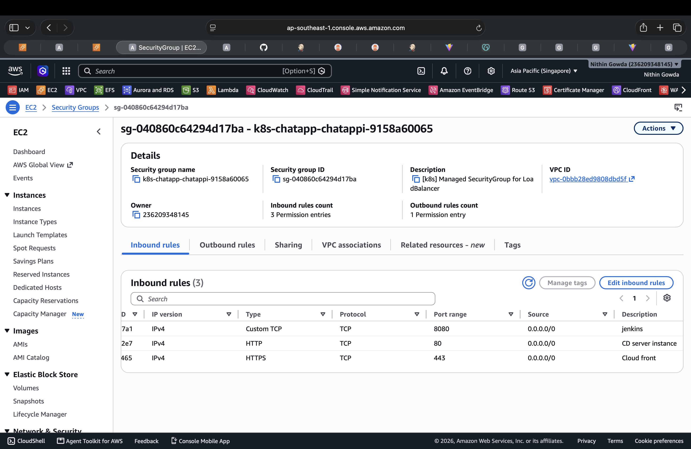

# 🔴 Security Setup

This section documents the AWS Security Groups used to control network access between the components of the Chat Application infrastructure.

AWS Security Groups act as stateful virtual firewalls for associated AWS resources. In this project, Security Groups are used to control access to EC2 servers, EKS resources, ALB, and the database layer.

---

# 🔴 1. Security Group Architecture

The main security boundaries in the project are:

```text
                         Internet / User
                               |
                               v
                        +--------------+
                        |   ALB SG     |
                        |  HTTP / HTTPS|
                        +------+-------+
                               |
                               v
                         +-----------+
                         |    EKS    |
                         | Cluster SG|
                         +-----+-----+
                               |
                 +-------------+-------------+
                 |                           |
                 v                           v
          Application Pods              Backend Pods
                 |                           |
                 +-------------+-------------+
                               |
                               v
                      +------------------+
                      |  DocumentDB SG   |
                      |   DB Port 27017  |
                      +------------------+

          CI Server SG  --->  ECR / AWS Services
          CD Server SG  --->  EKS / AWS Services
```

Security Groups should allow only the traffic required by the application. AWS recommends restricting access to the minimum necessary ports and sources.

---

# 🔴 2. CI Server Security Group

The CI server hosts Jenkins and the tools required for the CI pipeline.

Typical access includes:

- SSH access for administration
- Jenkins access through the ALB
- Private Jenkins access when required
- Outbound access to GitHub
- Outbound access to Amazon ECR and other AWS services

### Security Group Screenshot


> ⚠️ **Security Note:** Public Jenkins access on port **8080 is not recommended for production**; it is allowed here **only for practice/testing purposes**.

The Jenkins service can continue to run internally on port **8080** while access is provided through the configured ALB.

---

# 🔴 3. CD Server Security Group

The CD server is used for Kubernetes administration and Argo CD access through the private network/VPN.

Typical access includes:

- SSH access from the approved administration network
- Kubernetes API access
- Argo CD access through the private network
- Grafana access through the private network
- Outbound access to AWS services required for deployment

### Security Group Screenshot

> Final CD Server Security Group screenshot is maintained with the security configuration evidence for the project.

---

# 🔴 4. EKS Cluster Security Group

Amazon EKS uses Security Groups to control communication between the Kubernetes control plane, worker nodes, and other VPC resources.

The cluster Security Group provides the network boundary for EKS control-plane and cluster communication.

### Security Group Screenshot

> Final EKS Cluster Security Group screenshot shows the configured HTTPS, application/target traffic, ALB security-group reference, and cluster self-reference rules.

---

# 🔴 5. Application Load Balancer Security Group

The ALB Security Group controls access to the application entry point.

For the public chat application, the ALB allows the required web traffic from the Internet/CloudFront path.

For the internal Argo CD and Grafana ALB, access is restricted to the private network/VPN CIDR.

### HTTPS and Jenkins Access Rules



The ALB exposes HTTPS on port **443** for normal web access. Jenkins port **8080** remains publicly allowed in this practice project so the Jenkins CI/CD setup can be accessed directly during testing.

> ⚠️ **Security Note:** Public Jenkins access on port **8080 is not recommended for production**; it is allowed here **only for practice/testing purposes**.

---

# 🔴 6. DocumentDB Security Group

The DocumentDB Security Group controls access to the database layer.

The database should not be directly exposed to the Internet.

Application traffic should reach DocumentDB only from the approved application/node security boundary and on the required database port.

### DocumentDB Security Group


The database Security Group should follow the principle of least privilege and allow only the required application-to-database traffic.

---

# 🔴 7. Security Group Rules Summary

| Security Group | Main Purpose | Expected Access |
|---|---|---|
| CI Server SG | Protect Jenkins/CI server | Administration + Jenkins access + required outbound access |
| CD Server SG | Protect deployment server | Administration + EKS/AWS access |
| EKS Cluster SG | Protect EKS cluster communication | Required cluster/control-plane and workload traffic |
| ALB SG | Protect application entry point | HTTPS and required practice/test access |
| DocumentDB SG | Protect database | Database traffic only from approved application sources |

---

# 🔴 8. Security Principles Used

The Security Group configuration follows these principles:

- Allow only required ports
- Restrict administrative access to approved networks
- Avoid unnecessary Internet exposure
- Use Security Group references where appropriate instead of broad CIDR ranges
- Keep database access private
- Separate access boundaries for CI, CD, ALB, EKS, and database resources
- Review inbound and outbound rules before production changes

> ⚠️ **Practice Environment:** Jenkins public port **8080** is intentionally allowed for this project so the CI/CD setup can be accessed during practice/testing. This configuration is **not recommended for production**.

---

# 🔴 9. Final Security Architecture

```text
                         Internet
                            |
                            v
                    +----------------+
                    |     ALB SG     |
                    |  HTTPS :443    |
                    | Jenkins :8080  |
                    | (Practice Only)|
                    +--------+-------+
                             |
                             v
                    +----------------+
                    |   EKS / App    |
                    |  Cluster SG    |
                    +--------+-------+
                             |
                             v
                    +----------------+
                    | DocumentDB SG  |
                    |    :27017      |
                    +----------------+

       Admin Network / VPN
              |       |
              v       v
        +---------+ +---------+
        | CI SG   | | CD SG   |
        +---------+ +---------+
```

This layered Security Group design helps reduce unnecessary network exposure and provides separate security boundaries for the major AWS components used by the project.

---

# 🔴 10. Security Group Screenshots

The final security evidence includes the CI Server, Application ALB, EKS Cluster, CD Server, and DocumentDB Security Group configurations.

Current repository screenshots:

1. CI Server Security Group — `images/jenkins-ci-security-group.png`
2. Application ALB Security Group — `images/alb-security-group-https.png`
3. DocumentDB Security Group — `images/documentdb-security-group.png`

The EKS and CD Server screenshots were reviewed as part of the final security configuration. The repository can be updated with those latest screenshot files when required.