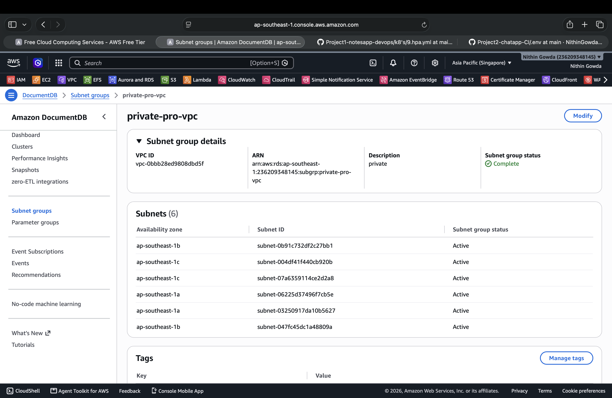
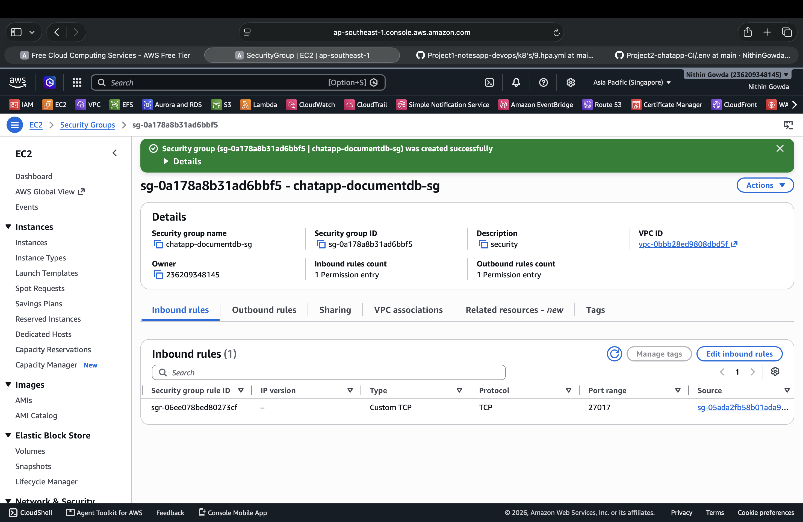
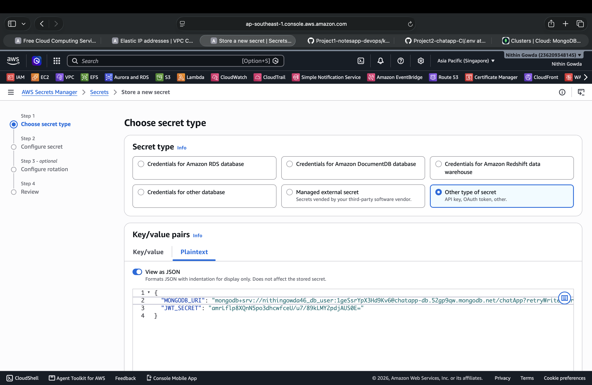
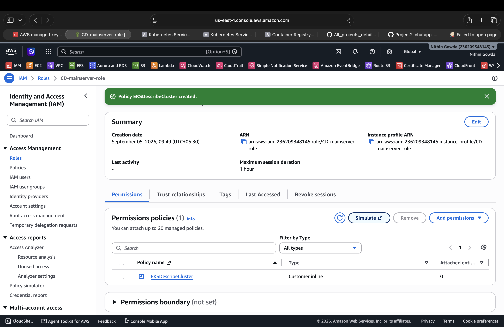
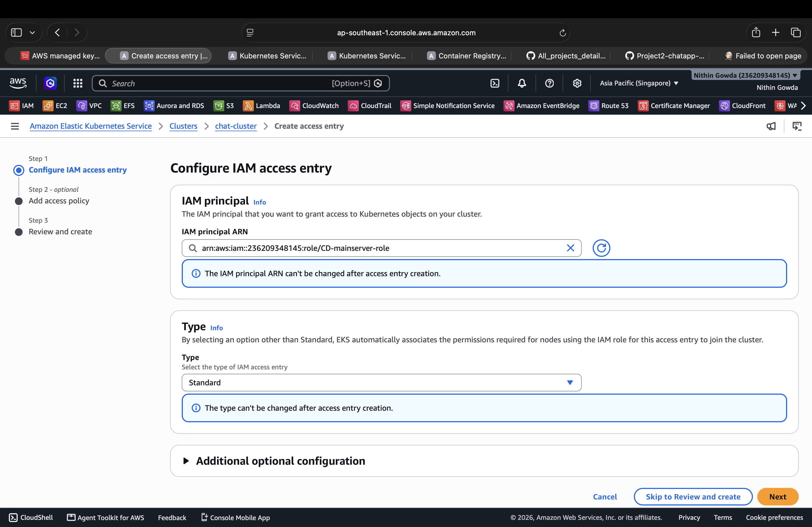
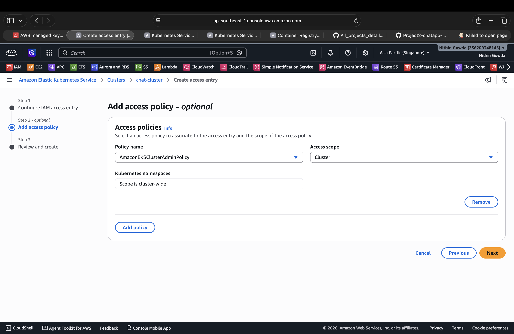
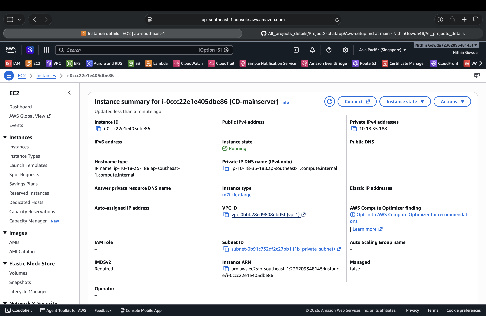

# 🔴 1. Amazon DocumentDB

Amazon DocumentDB is used as the managed MongoDB-compatible database for the application.

The database is deployed privately inside the VPC, and AWS Secrets Manager is used to securely store the application secrets.


---

## 1.1 Create DocumentDB Subnet Group

Before creating the Amazon DocumentDB cluster, create a **DB subnet group**.

Go to:

**AWS Console → DocumentDB → Subnet groups → Create**

### Subnet Group Configuration

- **Name:** `private-db-group`
- **Description:** `Private subnet group for ChatApp DocumentDB`
- **VPC:** Select the VPC used by the EKS cluster



---

## 1.2 Create DocumentDB Security Group

Create a dedicated security group for DocumentDB.

### Security Group

- **Name:** `chatapp-documentdb-sg`
- **VPC:** Same VPC as EKS

### Inbound Rule

```text
Type:        Custom TCP
Port:        27017
Source:      EKS security group
```

Do not allow:

```text
0.0.0.0/0
```



---

## 1.3 Create DocumentDB Cluster

Go to:

**AWS Console → DocumentDB → Clusters → Create**

### Cluster Configuration

- **Cluster type:** Instance-based cluster
- **Cluster identifier:** `chat-app-db`
- **Engine:** Amazon DocumentDB
- **Engine version:** Select the available compatible version
- **Instance class:** `db.t3.medium`
- **Number of instances:** `1`

### Connectivity

- **Network type:** IPv4
- **VPC:** Select the same VPC used by EKS
- **Subnet group:** `private-db-group`
- **VPC security group:** `chatapp-documentdb-sg`
- **Publicly accessible:** No

### Authentication

Select:

**Self managed**

Enter the database credentials manually.

Example:

```text
Username: chatappadmin
Password: <STRONG_DATABASE_PASSWORD>
```

Use a strong password and keep it secure.

### Encryption

- **Encryption:** Enabled

### Backup

- **Backup retention period:** `1 day`


> The service-linked IAM role required by Amazon DocumentDB is an AWS service requirement and is separate from database authentication. No separate service-linked-role setup is required in this guide.

---

## 1.4 AWS Secrets Manager

AWS Secrets Manager is used to securely store the DocumentDB connection string and JWT secret.

Go to:

**AWS Console → Secrets Manager → Store a new secret**

Select:

**Other type of secret → Plaintext**

### Generate JWT Secret

Run the following command on the **CI server**:

```bash
openssl rand -base64 32
```

Copy the generated value and use it as the `JWT_SECRET`.

### Secret Values

After the DocumentDB cluster is created, get the **Cluster endpoint** from:

**AWS Console → DocumentDB → Clusters → chat-app-db → Connectivity & security**

Create the MongoDB-compatible DocumentDB connection string:

```text
mongodb://<USERNAME>:<PASSWORD>@<DOCUMENTDB-ENDPOINT>:27017/chatApp?tls=true&replicaSet=rs0&readPreference=secondaryPreferred&retryWrites=false
```

Store the following values:

```json
{
  "MONGODB_URI": "mongodb://<USERNAME>:<PASSWORD>@<DOCUMENTDB-ENDPOINT>:27017/chatApp?tls=true&replicaSet=rs0&readPreference=secondaryPreferred&retryWrites=false",
  "JWT_SECRET": "<GENERATED_JWT_SECRET>"
}
```

### Secret Name

```text
chatapp/backend
```

Then select:

**Next → Next → Review → Store**



> The DocumentDB username and password are self-managed. The database password is stored securely inside AWS Secrets Manager as part of the application connection string.

---

# 🔴 2. Amazon EKS

Amazon EKS is used to run the application containers using Kubernetes.

## 2.1 EKS Cluster Creation

Create the EKS cluster with **EKS Auto Mode enabled**.

After reviewing the configuration, select **Create** to create the EKS cluster.

> No separate node group is required because EKS Auto Mode automatically manages the cluster compute resources.

---

## 2.2 IAM Role for CD Server EKS Access

An IAM role is created for the CD server so that the EC2 instance can authenticate with Amazon EKS.

### IAM Role

Create an IAM role with:

- **Role name:** `CD-mainserver-role`
- **Trusted entity:** AWS service
- **Use case:** EC2

An inline IAM policy is added to allow the CD server to describe the EKS cluster.

### Policy

```json
{
  "Version": "2012-10-17",
  "Statement": [
    {
      "Effect": "Allow",
      "Action": [
        "eks:DescribeCluster"
      ],
      "Resource": "*"
    }
  ]
}
```

The inline policy is named:

```text
EKSDescribeCluster
```



The `CD-mainserver-role` IAM role is then attached to the `CD-mainserver` EC2 instance.

---

## 2.3 EKS Access Entry

The CD server IAM role is added to the EKS cluster using an **EKS Access Entry**.

Go to:

**EKS → Clusters → chat-cluster → Access → Create access entry**

### Configure IAM Access Entry

- **IAM principal ARN:** `CD-mainserver-role`
- **Type:** `Standard`
- **Kubernetes groups:** Leave empty



### Add Access Policy

Associate the following EKS access policy:

- **Policy:** `AmazonEKSClusterAdminPolicy`
- **Access scope:** `Cluster`

This provides the CD server with cluster administrator access through the EKS API.



After creating the access entry, the CD server can authenticate to the EKS cluster using the IAM role attached to the EC2 instance.

---

# 🔴 3. CD Server Setup

The CD server is used for Continuous Deployment and deployment-related operations.

- **Name:** `CD-mainserver`
- **Instance Type:** `m7i-flex.large`
- **vCPU:** 2
- **Memory:** 8 GB
- **Subnet:** `1b_private_subnet`
- **Private IP:** `10.18.35.188`
- **Public IPv4:** None
- **Operating System:** Amazon Linux 2023
- **IMDSv2:** Required



## 3.1 Install Required Tools

### AWS CLI

[AWS CLI Installation Guide](https://github.com/NithinGowda46/installation_guide/blob/a05684a5e9f54c29c06bbf0135a8ac3900ef1c1f/8.AWS/.installation_amazonlinux.md)

### kubectl

[kubectl Installation Guide](https://github.com/NithinGowda46/installation_guide/blob/a05684a5e9f54c29c06bbf0135a8ac3900ef1c1f/4.kubernetes/kubeinstallation_AWS/kubectl.md)

### Argo CD

[Argo CD Installation Guide](https://github.com/NithinGowda46/installation_guide/blob/a05684a5e9f54c29c06bbf0135a8ac3900ef1c1f/5.agrocd/.installation_amazonlinux.md)

### MongoDB Shell

[MongoDB Shell Installation Guide](<MONGOSH_INSTALLATION_GUIDE_LINK>)

---

## 3.2 Configure EKS Access

Configure the CD server to access the EKS cluster.

### Configure kubeconfig

```bash
aws eks update-kubeconfig \
  --region ap-southeast-1 \
  --name chat-cluster
```

---

## 3.3 Configure Amazon DocumentDB

Configure the CD server to connect to the private Amazon DocumentDB cluster.

### Download DocumentDB TLS Certificate

```bash
wget https://truststore.pki.rds.amazonaws.com/global/global-bundle.pem
```

Verify:

```bash
ls -l global-bundle.pem
```

### Get DocumentDB Endpoint

Go to:

**AWS Console → DocumentDB → Clusters → chat-app-db → Connectivity & security**

Copy the **Cluster endpoint**.

### Connect to DocumentDB

Use the username and password that were configured during DocumentDB cluster creation.

Run:

```bash
mongosh \
  --tls \
  --host <DOCUMENTDB-ENDPOINT>:27017 \
  --tlsCAFile global-bundle.pem \
  --username <USERNAME> \
  --password
```

When prompted, enter the DocumentDB password.

A successful connection confirms that the CD server can reach the private Amazon DocumentDB cluster.
